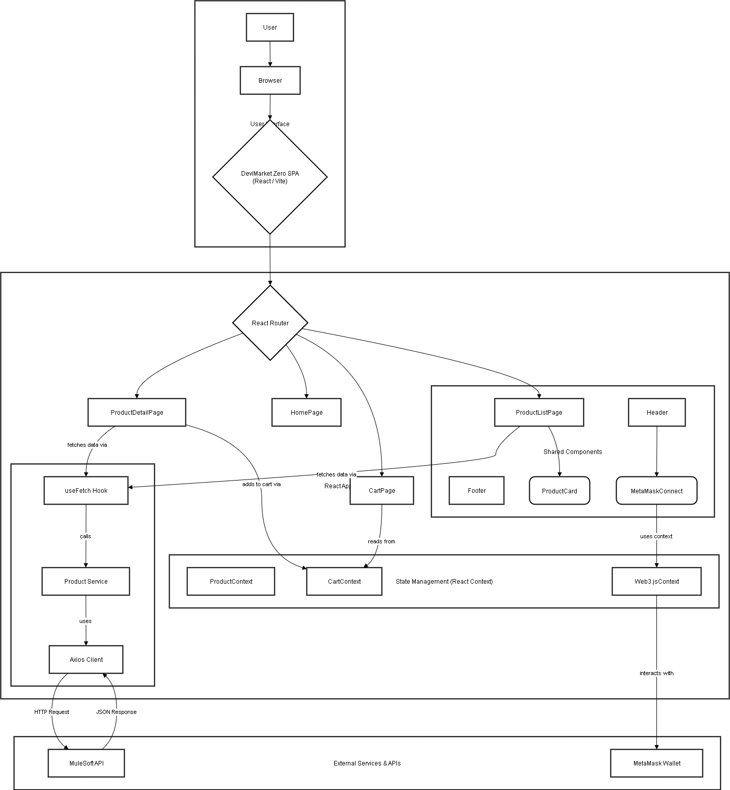

# DeviMarket Zero - React Frontend Technical Documentation

## 1. Introduction & Overall Architecture

This document provides a detailed technical overview of the DeviMarket Zero React frontend application. It is intended for developers, project stakeholders, and future contributors to understand the application's architecture, components, and core functionalities.

The application is a **Single-Page Application (SPA)** built with **React** and bootstrapped by **Vite**. This architecture was chosen for its fast development server, optimized build process, and rich ecosystem.

Key technologies used:

- **React 19**: For building the user interface.
- **Vite**: As the build tool and development server.
- **TypeScript**: For static typing and improved code quality.
- **React Router DOM**: For client-side routing.
- **Tailwind CSS**: For utility-first styling.
- **Axios**: For making HTTP requests to the backend APIs.
- **Vitest & React Testing Library**: For unit and component testing.

## 2. Folder Structure

The `src/` directory is organized by feature and responsibility to ensure a clean and scalable codebase.

- `src/assets/`: Static assets like images and icons.
- `src/components/`: Reusable UI components shared across multiple pages (e.g., `Header`, `Footer`, `ProductCard`).
- `src/constants.ts`: Global constants used throughout the application.
- `src/contexts/`: React Context providers for global state management (`Web3Context`, `ProductContext`, `CartContext`).
- `src/hooks/`: Custom React hooks that encapsulate reusable logic (e.g., `useFetch`).
- `src/pages/`: Top-level page components, each corresponding to a specific route (e.g., `HomePage`, `ProductListPage`).
- `src/services/`: Modules responsible for API communication (`apiClient`, `productService`).
- `src/types/`: TypeScript type definitions and interfaces.
- `src/utils/`: Utility functions, such as the application-wide logger.
- `src/App.tsx`: The root component that sets up the main layout, context providers, and routing.
- `src/main.tsx`: The main entry point of the application.

## 3. State Management

The application employs **React Context API** for global state management, avoiding the need for a larger state management library like Redux for this project's scale.

- **`ProductProvider`**: Manages the state of products fetched from the API.
- **`CartProvider`**: Manages the state of the shopping cart, including adding, removing, and updating items.
- **`Web3Provider`**: Encapsulates all logic related to MetaMask wallet connection, account state, and network changes.

## 4. Routing

Client-side routing is handled by **React Router DOM**. Routes are defined in `src/App.tsx`.

To improve initial load performance, the application uses **code-splitting** on a per-route basis. Page components are loaded lazily using `React.lazy()` and `Suspense`, ensuring that the code for a specific page is only downloaded when the user navigates to it.

A wildcard route (`*`) is configured to redirect any unknown paths back to the homepage, preventing 404 errors within the app.

## 5. API Consumption (MuleSoft Integration)

All interactions with the backend MuleSoft APIs are managed through a centralized service layer.

- **API Client**: A pre-configured **Axios** instance (`src/services/api.ts`) is used for all HTTP requests. This allows for centralizing configurations like the base URL and headers.
- **Product Service**: `src/services/productService.ts` contains functions (`getProducts`, `getProductById`) that abstract the API endpoints for products.
- **Data Fetching**: The custom hook `useFetch` (`src/hooks/useFetch.ts`) is the primary mechanism for fetching data in components. It handles loading states, errors, and cancellation logic automatically.
- **Error Handling**: The service layer includes robust error handling. If the API call fails, `productService` provides a local fallback data set to ensure the application remains functional. The `useFetch` hook further enhances this by catching errors and providing user-friendly error messages.

## 6. Key Components

### `ProductListPage.tsx`

- **Purpose**: Displays a list of all available products.
- **State**: Uses the `useFetch` hook to get the list of products from `productService.getProducts`. Manages loading and error states.
- **Props**: Receives pagination and filter data as props to control the displayed products.
- **Logic**: Maps over the fetched product data and renders a `ProductCard` component for each product.

### `ProductCard.tsx`

- **Purpose**: A reusable component to display a summary of a single product.
- **Props**: Receives a `product` object and displays its image, name, and price.
- **Logic**: Contains a link (`<Link>`) that navigates the user to the `ProductDetailPage` for that specific product.

### `ProductDetailPage.tsx`

- **Purpose**: Shows all details for a single selected product.
- **State**: It extracts the product ID from the URL using `useParams` from React Router and uses `useFetch` to call `productService.getProductById`.
- **Logic**: Displays all product attributes, including description, features, and an "Add to Cart" button.

### `MetaMaskConnect.tsx`

- **Purpose**: The UI component responsible for handling the wallet connection.
- **State**: It uses the `useWeb3` hook to access the account status, connection state, and error messages from `Web3Context`.
- **Logic**:
  - If a wallet is not connected, it displays a "Connect Wallet" button which triggers the `connect` function from the context.
  - If connected, it displays the user's truncated wallet address and a "Disconnect" button.
  - It also handles and displays connection errors provided by the context.

## 7. MetaMask Integration

Wallet integration is managed entirely within `src/contexts/Web3Context.tsx`.

- **Connection**: It detects if the MetaMask extension is installed. The `connect` function prompts the user to connect their wallet via `eth_requestAccounts`.
- **State Synchronization**: The context automatically detects the currently connected account on page load (`eth_accounts`).
- **Event Handling**: It subscribes to `accountsChanged` and `chainChanged` events. This ensures that the application's UI reacts instantly if the user switches accounts or networks in MetaMask.

## 8. Styling with Tailwind CSS

The user interface is styled using **Tailwind CSS**. This utility-first framework allows for rapid development by composing complex components from a set of low-level utility classes directly in the markup. The configuration is located in `tailwind.config.js`.

## 9. Custom Hooks & Utilities

- **`useFetch`**: As described in the API section, this hook is central to our data-fetching strategy, providing a robust, reusable, and error-handled way to get data from the backend.
- **`logger`**: A custom utility in `src/utils/logger.ts` is used for application-wide logging. It provides different log levels (info, warn, error) and can be extended to send logs to an external service in the future.

## 10. Running the Application

Instructions on how to run and build the application are detailed in `documentation/SETUP_REACT_FRONTEND_SPRINT2.md`.

- **Development Mode**: To start the development server with HMR:

  ```bash
  npm run dev
  ```

- **Production Build**: To generate a static, optimized build for deployment:
  ```bash
  npm run build
  ```
  The output will be located in the `dist/` directory, ready to be served by a static host or an application server like NGINX.

## 11. User Journey

This section outlines the typical path a user takes when interacting with the DeviMarket Zero application, emphasizing their experience and interactions at each stage.

### Step 1: Arriving and Discovering Products
- **Action**: A user lands on the homepage.
- **Experience**: They are greeted with a clean, modern interface that showcases featured products. This first impression is designed to be inviting and encourages exploration. The user can immediately get a sense of what the marketplace offers and is prompted to view the full catalog.

### Step 2: Browsing the Product Catalog
- **Action**: The user navigates to the `/products` page via the main menu.
- **Experience**: The `ProductListPage` displays a clear, paginated grid of products. The user can seamlessly browse through items using the `PaginationControls`. Loading states are handled gracefully with spinners, so the user understands that data is being fetched without the interface feeling unresponsive.

### Step 3: Viewing Specific Product Details
- **Action**: An interesting product catches the user's eye, and they click on its `ProductCard`.
- **Experience**: The user is navigated to the `ProductDetailPage` for that item. Here, they can view a larger image, read a detailed description, and examine specific attributes and tags. The page provides all the necessary information for the user to make an informed purchasing decision. A "Back to Products" link ensures easy navigation.

### Step 4: Adding Items to the Shopping Cart
- **Action**: From the product details page, the user decides to purchase an item and clicks the "Add to Cart" button.
- **Experience**: The UI provides immediate visual feedback, confirming the item has been successfully added. The user can then continue shopping with the confidence that their selection has been saved.

### Step 5: Connecting a Crypto Wallet
- **Action**: To prepare for checkout, the user clicks the "Connect Wallet" button, typically located in the header.
- **Experience**: The MetaMask browser extension prompts for connection, a familiar and trusted process for users in the Web3 space. Once connected, their wallet address appears in the UI, giving them the confidence that they are ready to transact securely. The application also handles account and network changes, providing a stable and predictable experience.

### Step 6: Reviewing the Cart
- **Action**: The user navigates to the `/cart` page to review their selections.
- **Experience**: The `CartPage` provides a clear summary of all selected items, their quantities, and the total price. The user can easily modify their cart (e.g., change quantity, remove an item) before finalizing their purchase, ensuring a transparent and user-controlled checkout process.

## 12. Architectural Diagram



## 13. Architectural Process Flow

This diagram outlines the frontend architecture of the DeviMarket Zero application, detailing the flow of data and user interactions. The architecture is designed to be modular and maintainable by clearly separating responsibilities.

---

#### **1. Starting Point: The User Interface**

Everything begins with the **User**.
1.  The user opens a **browser** (Chrome, Firefox, etc.).
2.  The browser loads the **DeviMarket Zero application**. React takes control of the UI, dynamically updating the content without requiring full page reloads.

---

#### **2. Application Navigation: The Role of React Router**

Once the application is loaded, **React Router** manages navigation.
-   It monitors the browser's URL (e.g., `/`, `/products`, `/cart`).
-   Based on the URL, the router determines which page component to display (e.g., `HomePage`, `ProductListPage`). This process provides a seamless and fast user experience.

---

#### **3. Data Flow Example: Displaying the Product List**

This is the most critical flow, illustrating how data travels from the API to the user. Assume the user navigates to the `/products` page.

1.  **Page Component (`ProductListPage`)**: React Router renders the page. This component's responsibility is to display a list of products.
2.  **`useFetch` Hook**: Instead of containing data-fetching logic itself, `ProductListPage` calls the `useFetch` custom hook. This is a reusable logic block that manages the "loading," "error," and "success" states of an API call.
3.  **Product Service**: The `useFetch` hook, in turn, calls a specific function from the **Product Service** (e.g., `getProducts()`). This service centralizes all functions that interact with product-related API endpoints.
4.  **Axios Client**: The Product Service uses a pre-configured **Axios** client. This is advantageous because all common settings (API base URL, headers) are defined in a single location.
5.  **HTTP Request**: The Axios client constructs and sends the HTTP GET request to the **MuleSoft API**.
6.  **JSON Response**: The API responds with the requested data, typically in **JSON** format.
7.  **Data Propagation**: The JSON response is received by Axios, returned to the Product Service, then to the `useFetch` hook, which finally updates the state of the `ProductListPage` component. When the state updates, React re-renders the component to display the list of products.
8.  **Shared Components**: `ProductListPage` uses the reusable `ProductCard` component to display each product in the list consistently.

---

#### **4. Global State Management (React Context)**

Certain data needs to be accessible across the entire application, not just within a single page. This is where React Context comes in.

-   **Shopping Cart Example (`CartContext`)**:
    -   When a user clicks "Add to Cart" on `ProductDetailPage`, the component itself does not manage the cart state.
    -   Instead, it calls a function from `CartContext` (e.g., `addToCart`).
    -   When the user navigates to the `CartPage`, that page reads the data directly from `CartContext` to display the items. This ensures the cart state is always synchronized, regardless of the user's current page.

-   **Wallet Example (`Web3Context`)**:
    -   The `MetaMaskConnect` component (located in the `Header`) needs to know if the user is connected with their wallet.
    -   It reads the state (wallet address, connection status) from `Web3Context`.
    -   The context is the only part of the application that communicates directly with the **MetaMask Wallet** browser extension, abstracting this complexity away from the UI components.

---

### **Architectural Benefits**

This architecture is considered a best practice for several reasons:

-   **Modularity**: Each part of the app (components, services, hooks) has a single responsibility and can be developed and tested independently.
-   **Reusability**: Components like `ProductCard` or logic blocks like `useFetch` are written once and used in multiple places.
-   **Maintainability**: If an API endpoint changes, the modification is only needed in the corresponding service file, without affecting the components that use it. If the look of a product card needs to change, only the `ProductCard` component is modified.
-   **Separation of Concerns**: UI logic (components) is completely separated from business logic (services) and state management (contexts).
